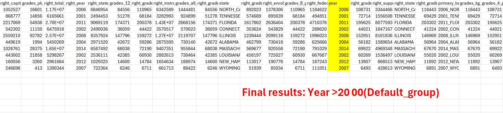

<ins>**Step-by-Step flow from AWS S3 - AWS Glue - AWS ATHENA using IAM roles and policies:**

**ENTIRE PIPELINE FLOW:**
* Initially we need data files (e.g., CSV, JSON) to upload into the S3 bucket.

 **1) Setup AWS S3 Bucket:** First, ensure we need an AWS S3 bucket where our data files is stored. If we don't have one, we need to create it in the AWS Management Console. 
 
 
 **2) Upload Data files to S3:** Upload our two data files (e.g., CSV, JSON) into the S3 bucket like we created two separate folders and we inserted one file in one folder.

 

 **3) Updating an IAM Role:**
* Go to the IAM console.
* Click on "Roles" from the left-hand menu.
* Click on "Create role".
* Choose the service that will use this role (AWS Glue).
* Attach policies that grant necessary permissions. At minimum, attach the "AWSGlueServiceRole", "AmazonS3FullAccess" policy to allow Glue to access resources.
* Review and name our role, then click "Create role" and finally role created successfully.

 

  **4) Attach Additional Policies:**

* Go to the Create policy and click JSON and remove the existing code and add the new JSON format which includes S3 bucket ARN in the place of Resource, then click next and then name our policy and create the policy.
* Now again come to the roles and click the specific role which we created in point 3, and then click add permissions then attach policies and search for  policy name which we created before(if we forget exact names then we search for customer managed  and we can give that names) and add permissions.

**5) Create a Glue Crawler:** 
* Go to the AWS Glue console and create a two new crawlers.
* Configure the two crawlers to point to the S3 bucket where our data is stored.
* Specify the IAM role we created earlier to allow Glue to access the S3 bucket.
* The crawler will automatically infer the schema of our data and create metadata tables in the Glue Data Catalog.

**6)Run the Both Glue Crawlers:** 
* Once the crawler is configured, we run the crawlers.
*  The crawler will scan the data in the S3 bucket, infer its schema, and create or update the metadata tables in the Glue Data Catalog.

**7)Setup Glue Studio:**
* Now, the entire ETL pipeline we create here and we will take the data from the source(s3) and do necessary transformations as per the requirement and finally we will send  the required data to the target(destinations) S3.

Above is the place where we do necessary transformations as per the company requirement and we will set up all the target data tables and also we give parquet format to the destination folders.

<INS>**REQUIREMENT:**
.

<INS>**STEPS TO BE TAKEN FOR THE REQUIRED TRANSFORMATIONS:**

* We have two files in the CSV and after we create a bucket with separate folder for each file. Once the files are uploaded into S3, we give necessary IAM roles and policies to allow Glue to access the resources.

* Now, we create two crawler jobs to inferring the schema of two files in the database by giving the source data and IAM role.

* Once the crawler jobs are run, we will get a data catalog two tables under the same database.

* Now, as per the requirement we go to Gluestudio(**ETL tool**) and  crete the pipeline which starts with two sources i.e, Amazon s3 and also we are selecting two data catalog tables as a source.

* I have some same column names in the two source tables.. for that we use **Renamed keys for join** to the second source for overlap elimination.

* The first transformation, we are applying on  join(inner join) condition based on the primary key.

**Select * from file1
inner join file2
on file1.primary_key = file2.right_primary_key**

*  Once the join condition is applied, we are applying conditional router transformation(output_group and default_group) based on the year. All the records with year < 2000 are separated from all the records with year >= 2000.

**Output_group  and default_group**
* In output group we give all records with year <=2000 and rest of the records which is greater than 2000 will automatically goes into default_group, and also each group we give separate target folders which has been create in the s3 and also we give IAM role and finally save the pipeline and successfully run the job.

 
 
* Now we get the parquet files in the separate folders of S3 bucket destination.

**Through Athena**

* Finally we will get two new tables in the data catalog tables and after that when we click view data(table data),it will automatically connect to ATHENA for querying the tables and provide the final results which we save in the S3 bucket target with new folder.(Go inside the folder and download the CSV file to view the results)

<INS>::**FINAL RESULTS::**

<INS>:::::::**CONCLUSION::::::::**

**By following all the above steps, we can setup a workflow to ingest data from S3 bucket into the Glue Data Catalog and querying the data catalog tables through Athena and finally send the results to the target S3 Bucket using IAM roles and policies to manage access control.**

