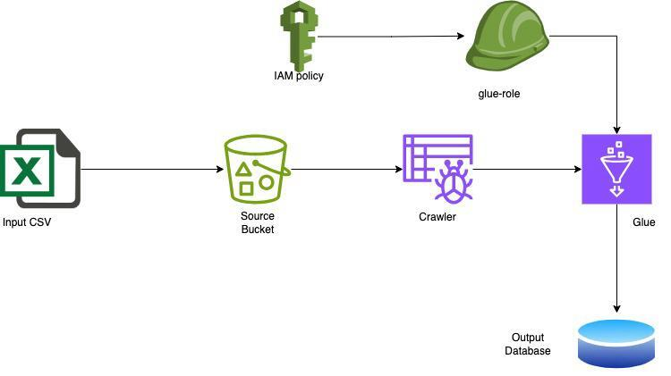
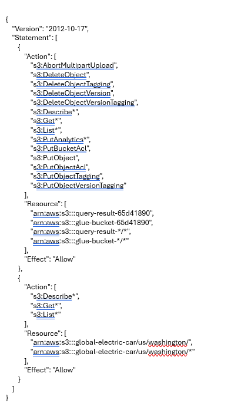

<ins>**Step-by-Step flow from AWS S3 to AWS Glue using IAM roles and policies:**

**FLOW:**

* Initially we need data files (e.g., CSV, JSON) to upload into the S3 bucket.

 **1) Setup AWS S3 Bucket:** First, ensure we need an AWS S3 bucket where our data files is stored. If we don't have one, we need to create it in the AWS Management Console.

 **2) Upload Data files to S3:** Upload our data files (e.g., CSV, JSON) into the S3 bucket. Make sure the data is organized in a way that makes sense for querying.

 **3) Create an IAM Role:**

* Go to the IAM console.
* Click on "Roles" from the left-hand menu.
* Click on "Create role".
* Choose the service that will use this role (AWS Glue).
* Attach policies that grant necessary permissions. At minimum, attach the "AWSGlueServiceRole" policy to allow Glue to access resources.
* Review and name our role, then click "Create role" and finally role created successfully.

**4) Attach Additional Policies:**

* Go to the Create policy and click JSON and remove the existing code and add the new JSON format which includes S3 bucket ARN in the place of Resource, then click next and then name our policy and create the policy.
* Now again come to the roles and click the specific role which we created in point 3, and then click add permissions then attach policies and search for  policy name which we created before(if we forget exact names then we search for customer managed  and we can the names) and add permissions.

**5) Create a Glue Crawler:** 
* Go to the AWS Glue console and create a new crawler.
* Configure the crawler to point to the S3 bucket where our data is stored.
* Specify the IAM role we created earlier to allow Glue to access the S3 bucket.
* The crawler will automatically infer the schema of our data and create metadata tables in the Glue Data Catalog.

**6)Run the Glue Crawler:** 
* Once the crawler is configured, we run the crawler.
*  The crawler will scan the data in the S3 bucket, infer its schema, and create or update the metadata tables in the Glue Data Catalog.

**By following all these steps, we can set up a workflow to ingest data from an S3 bucket into the Glue Data Catalog using IAM roles and policies to manage access control.**

<ins>**Explaining step by step AWS IAM POLICY JSON:**

* **Version:**
Specifies the version of the policy language. In this case, it's **"2012-10-17"**, which indicates the policy is written according to version **2012-10-17** of the IAM policy language.

* **Statements:**
This is an array containing one or more policy statements. Each statement describes a set of permissions.

* **Effect:**
 **"Allow:"**
Indicates that the actions specified in this statement are allowed.
* **Action:**
Specifies the actions that the policy allows. These actions are related to describing, getting, and listing objects in S3.
* **Resource:**
Defines the AWS resources to which the actions apply. Here, it allows actions on objects within the "global-electric-car/us/washington/" path in an S3 bucket, as well as any objects within that path.

**Overall, this policy grants permissions for various S3 operations on specific buckets and objects, as well as for describing, getting, and listing objects within a specific path in an S3 bucket.**

