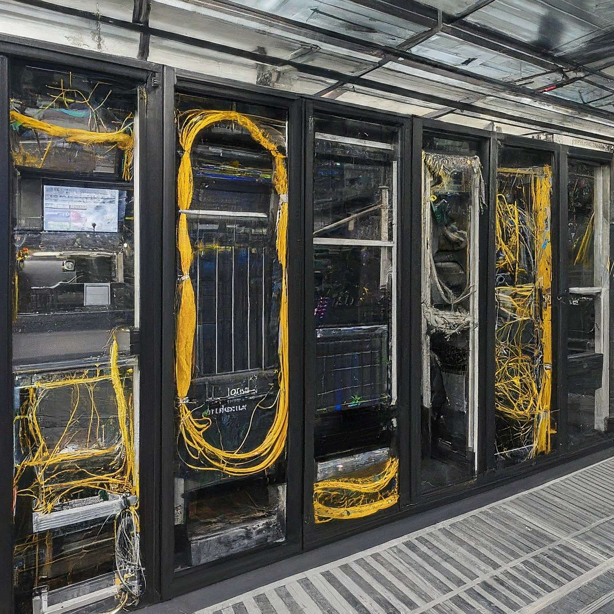

<ins>**DATA MESH PRINCIPLES AND ARCHITECTURE:**

**I WILL EXPLAIN STEP BY STEP PROCESS WITH DIAGRAMS**

<ins>**STEP1:**

**Demystifying Data Mesh: A Distributed Architecture for the Modern Enterprise**
* In today's data-driven world, organizations are struggling to manage and unlock the value of their ever-growing data. Traditional centralized data architectures are becoming cumbersome and slow to adapt. Data mesh offers a promising alternative, promoting a distributed and self-serve approach to data management. This presentation will explore the core principles of data mesh and how it can empower your organization to achieve greater agility and data-driven success.

<ins>**STEP2:**

**The Challenges of Traditional Data Architectures**

* **Data Silos:** Information is fragmented across different departments and systems, hindering collaboration and insights.
* **Slow Delivery:** Centralized teams become bottlenecks, delaying access to critical data for business users.
* **Limited Ownership:** Lack of accountability for data quality and accuracy leads to inconsistencies and errors.
* **Scalability Issues:** Centralized infrastructure struggles to keep pace with growing data volumes and user demands.
  
**Notes:**
Centralized data lakes and warehouses, while offering a single source of truth, often face significant challenges. Data silos and ownership issues prevent users from accessing and utilizing the data effectively. Slow delivery cycles hamper innovation and responsiveness to changing business needs. Additionally, centralized systems become expensive and complex to scale as data volumes increase.

<ins>**STEP3:**

**Introducing Data Mesh: A Distributed Approach**

* **Decentralized Ownership:** Business domains take ownership of their data, fostering accountability and expertise.
* **Self-Service Infrastructure:** Standardized platforms and APIs allow for easy data access and integration.
* **Data as a Product:** Domains publish well-defined and curated data sets as products for consumption by other domains.
* **Federated Governance:** Consistent data standards and quality are ensured through collaborative governance practices.

**Notes:**
Data mesh flips the script on traditional data architectures. Ownership of data is distributed to the business domains that understand it best. This fosters a deeper understanding of data needs and promotes data quality. Self-service infrastructure empowers domains to publish and manage their data through standardized APIs. Data becomes a product, enabling collaboration and knowledge sharing across the organization. Finally, federated governance ensures consistency and quality across the entire data mesh ecosystem.
  

  <ins>**STEP4:**

**Benefits of Data Mesh**

* **Increased Agility:** Faster data delivery and access fuel innovation and data-driven decision making.
* **Improved Data Quality:** Domain ownership fosters accountability and leads to cleaner, more reliable data.
* **Scalability and Flexibility:** The distributed architecture easily scales to accommodate new data sources and user demands.
* **Democratization of Data:** Self-serve access empowers a wider range of users to leverage data for insights.
  
**Notes:**
Data mesh offers a compelling set of benefits. By breaking down silos and empowering domains, data mesh fosters increased agility and faster time to insights. Decentralized ownership leads to a heightened focus on data quality and accuracy. The distributed architecture scales effortlessly to accommodate growth and evolving data needs. Finally, data mesh empowers a wider range of users to access and utilize data, driving a more data-driven culture across the organization.
 
  

